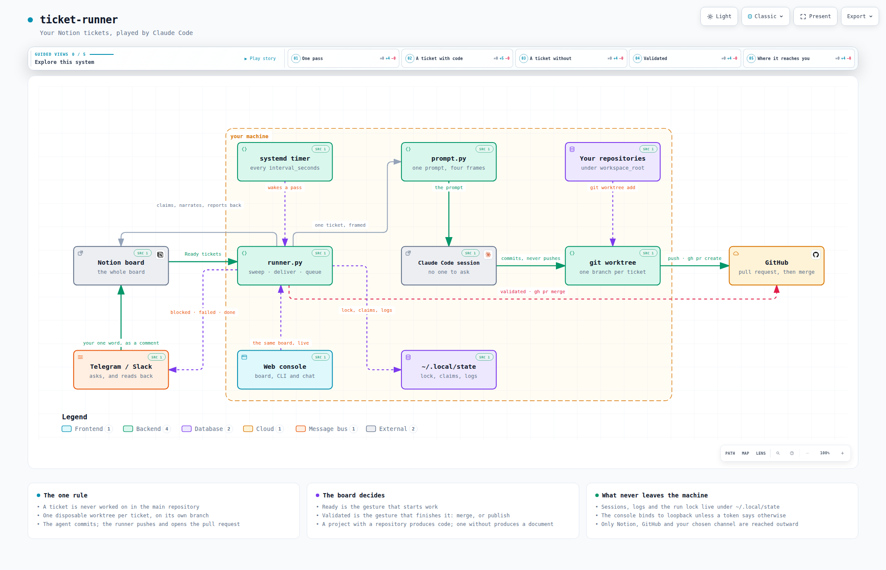

# ticket-runner

**Your Notion tickets, played by Claude Code.** You write a ticket, you move it to
*Ready*, and a few minutes later the work is waiting for you.

Not only the tickets about code. *"Remove that header"* comes back as a pull request on
its own branch; *"draft me a post about the new release"* comes back written into the
ticket page itself. Both live on the same board, and it is the ticket that decides which
one you get — not a setting.

And when you have read what came back, one column does the last step for you: move the
ticket to *Validated* and the runner merges that pull request, or publishes what it wrote
— the post, the mail, the announcement — and only then calls it *Done*. See
[Validated, and what it sets off](#validated-and-what-it-sets-off).

The runner lives on your machine, in the background, across **all of your projects at
once**. It never touches your working copy: every ticket gets a disposable git worktree of
its own.

And you can talk to it where the work is. A comment under one of its reports is
answered, in the thread, by something that has read the ticket, the project and the
repository — see [Talking to it in the comments](#talking-to-it-in-the-comments).

And when you would rather have your hands on it than wait for a board to refresh,
`ticket-runner serve` opens a console on `127.0.0.1`: the same board live, this CLI in a
browser, and a chat with your whole workspace. See [The web console](#the-web-console).

And when you are not at a keyboard at all, it comes to you: a ticket the agent would not
guess at asks its question on **Telegram or Slack**, and *oui* is the whole answer — the
reply lands on the ticket and the next run carries on. See
[Being told, and answering with one word](#being-told-and-answering-with-one-word).

```
Notion                    ticket-runner                       what you get
──────                    ─────────────                       ────────────

Ready         ──────▶     claims it, writes the session link
                          │
In progress   ◀───────────┤
                          │
                          ├─ has a repository ──▶  worktree, branch, commits
                          │                        push + gh pr create      ──▶  a pull request
                          │
                          └─ has none ──────────▶  scratch dir, ANSWER.md
                                                   published as Notion blocks ──▶  the page itself
In review     ◀───────────  a pull request is waiting for you
Validated     ──────▶     merges that pull request — or publishes what the
                          ticket holds: the post, the mail, the announcement
Done          ◀───────────  once it is in
```

Which of the two you get is decided by the project, not by a setting: a project that names
a repository produces code, a project that names none — or a ticket with no project at all
— produces a document.

---

## Architecture



Everything inside the dotted frame runs on your machine and nowhere else. Three things are
outside it, and they are the only three the runner reaches: the Notion board it reads and
writes, GitHub when a branch becomes a pull request, and the channel you chose to be asked
questions on.

The picture is a still of an interactive diagram. `diagrams/architecture.html` is a single
self-contained file — open it in a browser and you can follow the five guided views (one
pass, a ticket with code, a ticket without, validated, where it reaches you), focus a
component, or click a node through to the file it is drawn from.

### Regenerating it

The diagram is generated by [archify](https://github.com/tt-a1i/archify) from
`diagrams/ticket-runner.architecture.json`, which is the file to edit — never the HTML.
The renderer is installed rather than vendored, and `.gitignore` keeps it out of the tree:

```bash
npx skills add tt-a1i/archify --skill archify --agent claude-code --copy   # archify 2.16
ARCHIFY=.claude/skills/archify/bin/archify.mjs

# The source declares a pinned revision, so the file links it draws are checked
# against a real checkout: bump meta.repository.revision when you regenerate.
node $ARCHIFY validate architecture diagrams/ticket-runner.architecture.json \
  --quality showcase --repo-root .

node $ARCHIFY deliver architecture diagrams/ticket-runner.architecture.json \
  diagrams/architecture.html --quality showcase --repo-root .

# Recapture the still the README shows, and keep the 2048x1320 light one
node $ARCHIFY visual-check diagrams/architecture.html
cp diagrams/architecture.visual-check.2048x1320.light.png diagrams/ticket-runner.png
rm diagrams/architecture.visual-check.*
```

`deliver` refuses to write an artefact that fails its own layout and composition checks, so
a diagram that lands is a diagram that reads.

---

## Installation

```sh
curl -LsSf https://raw.githubusercontent.com/SalvadorCardona/ticket-runner/main/install.sh | sh
```

The script checks the dependencies, installs the `ticket-runner` command into
`~/.local/bin`, asks for your Notion token, and arms a systemd timer that picks up ready
tickets **every 30 minutes** — `interval_seconds` in the configuration changes that, down
to a few seconds if you want a ticket picked up as soon as you move it. It also starts
the [web console](#the-web-console) on `http://127.0.0.1:8787` and prints the address to
open it with; `TR_NO_WEB=1` leaves it stopped. Then:

```sh
ticket-runner doctor
```

which tells you, line by line, what is still missing.

Running the same command again **updates** the installation: the code is replaced, your
configuration is kept.

You will rarely need to. The installer clones the repository into
`~/.local/share/ticket-runner/app`, which is what lets the runner answer *"am I still on
the latest version"* with one `git fetch`. A run looks at the clock before it looks at the
tickets: **once an hour** it asks, and if the answer is no it updates itself — the
launcher and the systemd units included — before claiming a single ticket. The change
therefore lands between two sessions, never inside one, and the new code takes over on the
next pass.

```sh
ticket-runner update --check   # what is available, changing nothing
ticket-runner update           # apply it now
```

`runner.auto_update = false` turns the automatic half off; `runner.update_interval_seconds`
changes the hour. An installation made from a local copy (`TR_SRC=.`) has no remote to
compare itself against: it says so once per check and carries on.

> **Requirements** — Linux with systemd in the user session, `python3` >= 3.11 (no
> dependencies to install, everything is in the standard library), `git`,
> [Claude Code](https://claude.com/claude-code), and `gh` authenticated for pull requests.

| Variable | Effect |
| --- | --- |
| `TR_INTERVAL=10` | seconds between two runs (default: 1800, i.e. 30 min) |
| `TR_NO_SERVICE=1` | no timer and no console: you run `ticket-runner run` yourself |
| `TR_NO_WEB=1` | the console's unit is installed, but left stopped |
| `TR_SRC=.` | install from a local clone, without the network — and without self-updating |
| `TR_REF=v1.2` | install a tag instead of `main`, and stay on it |

---

## Configuration

Everything lives in **`~/.config/ticket-runner/config.toml`**, created by the installer
with mode `600` — it holds your Notion token. `ticket-runner config` opens it in
`$EDITOR`.

### 1. Create a Notion integration

The runner works alone, on your machine, at three in the morning. It needs an identity of
its own: an **internal integration**, which is a robot account with its own token.

On [notion.so/my-integrations](https://www.notion.so/my-integrations) → **New
integration** → give it a name (`ticket-runner`), pick your workspace, type **Internal**.
Copy the token it shows you; it starts with `ntn_`.

### 2. Share one page with it

Open any Notion page — an empty one will do — and share it: the `···` menu, top right →
**Connections** → your integration. That click is the floor: an integration cannot grant
itself access, so it is the one step no command can take for you.

### 3. Let the runner build the rest

```sh
ticket-runner init https://www.notion.so/your-page --token ntn_…
```

It creates everything under that page and writes the result into your configuration:

```
your page                 ← the one you shared
└── ticket-runner         ← the workspace: its rows are the master pages
    ├── Tickets           ← the tickets database, 12 columns, 2 relations
    ├── Projects          ← Name, Repository, Path
    ├── Agents            ← the roles a ticket can be handled by
    └── Context           ← a plain page: who you are
```

Plus a demonstration ticket, left unstarted, so the first thing you do is move something
to *Ready* and watch it work.

**Running it again is safe** — and is how you upgrade. Nothing is duplicated: what exists
is kept, what a previous version did not know how to create is added, and a column you
retyped on purpose is never overruled.

> One Notion quirk shows through: the API cannot create a `status` property, so `Status`
> is made a **select** with the same five options. The runner reads either — it looks at
> the declared type and writes accordingly — so this changes nothing but the icon.

You name the directory once; the runner finds the rest by the **title of a row**. Rename
a row and tell the runner what it is now called, under `[notion.pages]`:

```toml
[notion.pages]
tickets = "Tickets"     # required
projects = "Projects"   # optional — only `doctor` uses it
agents = "Agents"       # optional — see below
context = "Context"     # optional — see below
```

Rows created under the names this shipped with before — `Master Tickets`, `Soul` — are
still found as long as this table does not name them otherwise. There is nothing to
rename on an existing board.

If you would rather point at one database than share a whole workspace, `tickets_database`
still works exactly as before, and wins over the workspace when both are set. The URL of
the database is enough, and if it is inline inside a page, the page URL works too: the
runner looks inside and finds the database on its own.

Three ways to get them in, whichever you prefer:

```sh
ticket-runner config      # opens the TOML in your editor — the cleanest

# or let the installer ask you (it does, on a fresh install):
curl -LsSf https://raw.githubusercontent.com/SalvadorCardona/ticket-runner/main/install.sh | sh

# or in one line:
sed -i 's|^token = .*|token = "ntn_…"|' ~/.config/ticket-runner/config.toml
```

### The step everyone forgets

A valid token on a page that was never shared answers `object not found`, and nothing
about it hints at why — which is why step 2 is the sharing. Everything created underneath
inherits that access in one gesture, and that is also what makes the relations legal: a
relation can only point at a database the same integration can reach.

> **What you share is what the runner can read.** Anything under that page reaches the
> prompts it writes, and prompts are kept on disk in `~/.local/state/ticket-runner/`. Keep
> credentials out of the workspace — a page of environment variables is exactly the kind
> of thing that should live in a password manager instead.

Then:

```sh
ticket-runner doctor
```

which checks the token, the access to the database, the type of every column and the
presence of each status — and names whichever of those was missed.

### 4. The rest of the file

Every key below is also a field in the console's **Settings** tab —
`ticket-runner serve`, and the same file, drawn as a page. What follows is the same list,
for reading rather than for filling in.

| Key | Default | Effect |
| --- | --- | --- |
| `runner.workspace_root` | `~/workspace` | where to look for repositories |
| `runner.interval_seconds` | `1800` | seconds between two passes — `ticket-runner enable` applies a change |
| `runner.max_concurrent` | `2` | tickets handled side by side in one run |
| `runner.timeout_minutes` | `30` | past this, the session is killed and the ticket fails |
| `runner.model` | `""` | `"opus"`, `"sonnet"`… empty = the CLI's default |
| `runner.permission_mode` | `"bypassPermissions"` | see *What protects your code* below |
| `runner.branch_prefix` | `"ticket/"` | prefix of the created branches |
| `runner.base_branch` | `""` | empty = each repository's default branch |
| `runner.push` | `true` | `false`: commits stay local |
| `runner.open_pull_request` | `true` | `false`: the branch is pushed, without a PR |
| `runner.merge_method` | `"squash"` | how a **validated** pull request is merged — `squash`, `merge`, `rebase` |
| `runner.keep_worktree_on_failure` | `true` | keep enough around to understand a failure |
| `runner.notify` | `true` | one desktop notification per finished ticket — `[notify]` carries it to your phone |
| `runner.auto_update` | `true` | a run keeps the installation on the latest version |
| `runner.update_interval_seconds` | `3600` | how often a run asks; one minute is the floor |
| `runner.log_retention_days` | `14` | drop older session logs; `0` keeps everything |
| `runner.attach_sessions` | `true` | file each session under its project, so `claude --resume` there lists it |
| `runner.prompt_file` | `""` | your own prompt template, for repository tickets |
| `runner.document_prompt_file` | `""` | the same, for tickets with no repository |
| `runner.delivery_prompt_file` | `""` | the same, for publishing a validated ticket |
| `notion.workspace` | `""` | the database whose rows are your master pages |
| `notion.tickets_database` | `""` | one database instead of a workspace; wins when both are set |
| `[notion.pages]` | | which row of the workspace is the tickets database, the projects database, the agents database, the context page |
| `[notion.properties]` | | if your columns have other names |
| `[notion.status]` | | if your statuses have other names |
| `[projects]` | | `"Notion name" = "/path"` for repositories that cannot be guessed |
| `[web]` | | the console's host, port and token — see *The web console* |

---

## The Notion side

### The tickets database

| Property | Type | Role |
| --- | --- | --- |
| `Name` | title | what the agent must do, in one line — leave it empty and the runner writes one from the body |
| `Status` | status *or* select | **what drives the whole system** — see below |
| `Project` | relation | *optional* — to the projects database: decides the repository |
| `Agent` | relation | *optional* — to the agents database: decides who handles it |
| `Runner` | text | filled by the runner: which machine took the ticket |
| `Pull Request` | URL | filled by the runner at the end |
| `Session` | **URL** or text | written as soon as the ticket is claimed. Make it a URL and it becomes a link that opens the session; leave it text and it holds the bare ID |
| `Priority` | select | *optional* — `Urgent`, `High`, `Normal`, `Low`. Decides which ready ticket runs first |
| `Model` | select | *optional* — `opus`, `sonnet`, `haiku`. This ticket's model, over its agent's and over `runner.model` |
| `Cost` | number | *optional* — written back, in dollars |
| `Duration` | number | *optional* — written back, in minutes |
| `Progress` | text | *optional* — **what the session is doing right now**, rewritten every ten seconds |
| `Scheduled` | date | *optional* — **hold the ticket until that moment**, then run it — or, on a validated ticket, publish it |

`Scheduled` is what turns the board into a calendar. A ticket without one starts within
seconds of reaching the ready column, so a date on it can only mean *not yet*: the runner
leaves it alone until the moment comes, then treats it like any other. Write the release
post on Monday, run the monthly report on the first — the ticket sits ready and waits.

The same date is honoured in *Validated*, which is where it pays off for work that is
already **finished**: the post is written, you have read it and said yes, and it still goes
out at the hour you chose. Accept it on Tuesday for Thursday 18:00 and it sits in its
column until Thursday 18:00 — no alarm to set, nothing to come back and click. Merges wait
the same way: one column, one rule.

A bare date means the start of that day in the runner's own timezone, so a ticket dated
30 August begins on the 30th rather than at some hour dictated by UTC. A date with a time
is taken as written, offset included. A range starts at its end — the moment the thing is
due. And a value the runner cannot read never holds a ticket back: a ticket is not frozen
by a date that failed to parse.

Precision is to the minute, and that limit is Notion's rather than the runner's: it stores
`14:48:27` as `14:48`. With a ten-second cadence a ticket therefore starts within a few
seconds of the minute you named, which is as close as the board can express.

The last six are optional in the strict sense: a database without them behaves exactly as
before, because the runner only ever writes properties the schema declares. Add them and
you get a queue you can steer — a cheap model for a documentation ticket, an expensive one
for a refactor — and a board that shows what each ticket cost.

The **body** of the ticket page is sent to the agent as the description. Write there what
you would tell a developer who does not know the subject: what must change, where, and
how you will know it is done.

And you may stop there. A ticket is often written the way the thought arrives — the
content first, the title never — so a ticket that reaches *Ready* without one is named by
the runner: a very short session reads the page and writes a title back **into Notion**,
in the language the page is written in, so the board shows it too. It happens before the
branch is drawn, which is what the title is first used for: `ticket/reparer-le-bandeau-…`
rather than one more `untitled-ticket`. A ticket that already carries a title keeps
exactly the one you gave it and costs nothing extra; a ticket with neither a title nor a
body is not invented for — it comes back with the question. And if the naming fails, for
want of a session or of a Notion that accepts the write, the ticket runs all the same,
under the label it had.

### Following the work

#### Live, on the ticket itself

A run used to say nothing between *In progress* and the pull request. Now it narrates:
while the session works, its steps are written **into the ticket**, on a ten-second
cadence.

Two places, and they answer two different questions.

- **The page** gets one toggle per run — `⏳ Live — 12 step(s) · 3 min` — and under it a
  bullet per file read and per command run, and what the agent *said* as a paragraph of
  its own, whole and in its own markdown, under a rule that keeps the two apart. Open it
  to watch the work; leave it collapsed and its title alone tells you it is moving. When the
  run ends the toggle settles into `✓ 27 step(s) · 6 min · removed the header`, and stays
  as the story of what happened.
- **The `Progress` column** carries the last line, so a glance at the board — from a
  phone, without opening anything — shows which ticket is on `Bash · npm test` and which
  is still reading. It is cleared when the run ends: the comment, the status and the pull
  request speak from then on.

```
⏳ Live — 12 step(s) · 3 min
   •  Read    src/app/header.component.html
   ──────────────────────────────────────────────────────────────────────
   I will remove the banner from the template and the stylesheet rules that
   went with it, then run the tests.
   •  Edit    src/app/header.component.html
   •  Bash    npm test -- --watch=false
```

A **cadence, not a stream**: a session emits several events a second, and writing each one
would rewrite the page continuously, spend the integration's rate limit and produce
something nobody can read. Ten seconds is the default, five the floor:

```toml
[runner]
progress = true
progress_interval_seconds = 10
```

What reaches the ticket is a line per tool call — `Bash · npm test`, never the eight
hundred lines it printed. What the agent *says* is the part a human reads, so it is not
shortened: it goes down entire, and only a turn of several thousand characters is ever
cut. Long sessions stop at three hundred steps, with a line saying so: a ticket page is
not a log file. And a board with no `Progress` column, or an integration
that refuses the write, costs the report and nothing else — the ticket runs to its end
either way.

`ticket-runner init` adds the column to an existing board; the toggles need nothing.

#### From the terminal

`Session` is filled **when the ticket is claimed**, not when it finishes — so a ticket
sitting in *In progress* is exactly the one you can look into:

```sh
claude --resume <session id>          # reopen the conversation, read it, carry on
ticket-runner logs -f                 # the live feed of the running session
ticket-runner logs <ticket id>        # a past session, rendered
ticket-runner logs <ticket id> --raw  # the raw JSON stream
```

**Make `Session` a URL property and its cell becomes a button.** Clicking it opens a
terminal already inside that conversation — no identifier to copy, no directory to find.
`install.sh` registers a `ticket-runner://` scheme with your desktop for exactly this, and
`ticket-runner open <link>` is what runs behind the click. Which of the two you get is
decided by the column's type in Notion, nothing to configure: a URL column gets the link,
a text column gets the identifier.

The terminal is picked from the usual suspects — GNOME Terminal, Konsole, xfce4-terminal,
kitty, Alacritty, foot — or set `TICKET_RUNNER_TERMINAL` to yours.

Every ticket is a **real Claude Code session** — not a private log format, the same
transcript your own sessions produce. `claude --resume` works from any directory, and
keeps working after the worktree is gone: the transcript lives in `~/.claude/projects/`,
not in the checkout.

By default they also **show up in the project's session picker**. A session started
inside a disposable worktree would otherwise be filed under that worktree, so opening
`claude` in the repository would never list it; when a ticket finishes, the runner moves
its transcript under the repository's own directory instead. Open `claude` in the repo,
pick the session, and you are inside the conversation that produced the pull request.
Tickets with no repository are filed under `workspace_root`. Set
`attach_sessions = false` to leave them where they ran.

This one reaches into Claude Code's own storage layout, so it is written to fail quietly:
if the layout ever changes, the move is skipped and the session stays resumable by its
identifier, exactly as before.

While a session runs, its worktree is also a normal repository —
`git -C ~/.local/state/ticket-runner/worktrees/<name> diff` shows you what it has changed
so far.

The runner also posts a comment on the ticket when it finishes, carrying the summary, the
branch, the pull request and the resume command. That one needs a capability the
integration does not get by default: **notion.so/my-integrations → your integration →
Capabilities → Insert comments**. Without it the run still succeeds, and the log says the
comment was refused with a 403.

### The projects database

One row per project, and **the project decides what kind of work its tickets are.**

A project that names a repository is a **code project**. Its tickets get a git worktree, a
branch, commits and a pull request. Three ways to name it, most explicit first:

1. a `[projects]` entry in your configuration — `"Trader Ia" = "~/workspace/labo/trader-ia"`;
2. a **`Path` property on the project page**, which keeps the mapping on the board rather
   than in a file on one machine;
3. a **`Repository` property** — a GitHub URL or `owner/name` — matched against the
   `origin` remotes of every repository found under `workspace_root`.

Both columns are read by name, whatever their capitalisation, and the `github` column
earlier versions asked for still works.

A project that names none — and **a ticket with no project at all** — is **document work**.
It gets a disposable scratch directory instead of a worktree, and the agent's answer is
written back into the Notion ticket as real blocks: headings, lists, checkboxes, links.
No branch, no pull request. That is what you want for *"draft me the steps to become a
certified trainer"* or *"summarise this for me"*: there is nothing to commit, and the
deliverable is the page itself.

**Whatever you write on the project page becomes standing instructions** for every
ticket of that project. Not the ticket's page — the *project's*. It is prepended to the
brief the agent receives, so it is written once instead of retyped into every ticket:

> **Communication**
> Tone: first person, short sentences, no superlatives. No emoji, no hashtags. Show a
> verifiable number, not a promise. If the tool has a limit, say it.
> X: 280 characters for a single post. Always offer two or three angles.

That is what turns *"write me a post about the new tool"* into your voice rather than a
generic one — and, on a code project, what carries conventions that do not belong in any
single ticket. An empty project page costs nothing and changes nothing.

The runner never guesses from a project's name. A name that happens to match a folder is
a coincidence, and turning a writing task into commits on a like-named repository is a
worse outcome than asking you to be explicit. But a repository that *is* named and does
not exist is an error, and blocks the ticket rather than silently falling back.

`ticket-runner projects` shows you which is which for every referenced project — worth
running once after installation; it is what saves you from surprises.

### The context page — who the work is for

One row of the workspace, named `Context` by default, is a plain page with no database in it.
Whatever you write there goes into **every prompt, on every project**, ahead of the
project's brief:

```
the context page   who you are, what you work with, how you like things written
      ↓
the project page   the conventions of THIS project
      ↓
the ticket         the task
```

From the widest frame to the narrowest, so the specific is read last and wins when the two
disagree. What belongs there:

> Je suis Salvador Cardona, développeur web depuis 13 ans. Je travaille sur Animalink.
> Stack: PHP/Symfony, React, Docker. `pnpm`, jamais `npm`.
> Réponses courtes, pas d'emoji, la commande plutôt que l'explication.

It pays for itself mostly on **document tickets**: there the agent starts in an empty
directory and knows nothing about you at all, whereas on a code ticket the repository and
its `CLAUDE.md` already answer most of it.

Two things to keep in mind. **Keep it to one screen** — it is the one text billed on 100 %
of your tickets, and a long preamble dilutes the ticket itself. And what belongs to a
single project belongs on that project's page, not here: the test is whether it would
change the answer on a ticket of *any* project.

The page is optional. Without it the runner behaves exactly as before, and says so once
per run rather than leaving you to wonder.

### The agents database — who handles the ticket

A project says *where* the work happens. It says nothing about **who** does it, and
“fix this regression” and “write this announcement” are not the same craft on the same
repository.

Add an `Agent` relation column on your tickets, pointing at a database of agents. One row
per role, and **the body of its page is the role**, exactly as a project page is its brief:

> **Dev front**
> Tu touches au CSS avant le JS. Aucune dépendance nouvelle sans raison écrite.
> Un test qui reproduit le bug avant le correctif.

An agent row may also carry a `Model`, which is how a rewriting ticket runs on a cheaper
model than a refactor. The narrowest choice wins:

```
the ticket's Model  →  its agent's Model  →  runner.model
```

The role is read after your context page and after the project's brief, and **it can never
loosen the frame**: committing without pushing, and answering `RESULT: blocked` rather than
guessing, live in the template, above anything a page can say.

All of it is optional twice over: a tickets database with no `Agent` column behaves exactly
as it always has, and a ticket that names no agent runs on the runner's own prompt.

### The discussion on a ticket

The comments of a ticket go into the prompt, oldest first, which closes the loop the
`blocked` status opens: a run asks a question, you answer it in a comment — and the next
run reads your answer instead of asking again.

**Answering is the whole gesture.** The reply itself puts the ticket back in the queue:
nothing to move on the board, the runner claims it and it goes to *in progress* for as
long as the new run lasts. Which is narrow on purpose, because not every comment is an
instruction:

- only tickets **the runner has already reported on** wake up. A comment on a ticket no
  run of ours ever touched is a conversation of yours, and one handled by another machine
  is that machine's to pick up — a report is signed `ticket-runner@<host>`;
- only when **someone else has had the last word** since that report. The report the next
  run posts is also what closes the ticket again;
- and never a ticket that came back with its pull request. *In review*, *Validated* and
  *Done* are all answers already: comment on one and nothing happens — the discussion
  belongs to the pull request, and a validated ticket is about to be carried out. A ticket
  already ready, or one in flight, is left where it is too.

So it is `blocked` and `failed` that come back to life, which is where a run leaves a
ticket it could not finish, and precisely where an answer is expected.

The runner's own reports are included too, trimmed to their verdict and reason; the branch
names, session IDs and log paths they carry are of no use to a session. At most the last
ten comments and 2000 characters, newest kept, so a ticket that has been round three times
does not spend more of its prompt on its own history than on the work.

This needs one capability the integration does not have by default:
[notion.so/my-integrations](https://www.notion.so/my-integrations) → your integration →
**Capabilities** → *Read comments*. Without it the runner says so once and carries on —
and no ticket ever wakes up, since it cannot see the answer. `ticket-runner doctor` tries
it on a real ticket and tells you.

### Talking to it in the comments

Running a ticket again is the right answer to *do it differently*. It is the wrong answer
to *why did you do it like that?* — which is most of what one actually wants to say to
something that has just written code on one's behalf.

So a comment can also simply be **answered**. Reply under one of its reports and it
replies, in the same thread, in the language you wrote in:

> **ticket-runner@laptop — done.** Removed the header from the dashboard.
> Branch `ticket/supprimer-l-entete-9d2cb790` · 2 commit(s) · <https://github.com/…/pull/12>
>
> > **you** — pourquoi une nouvelle branche plutôt que celle d'hier ?
> >
> > **Ticket Runner** — celle d'hier était déjà partie en revue sur la PR #11, et y
> > pousser aurait mélangé deux changements sans rapport. La nouvelle part de `main`,
> > qui contient déjà #11.

Nothing is claimed, no status moves, nothing is built. It reads the ticket, the thread,
the project's brief, the context page and — for a ticket that has a repository — the
repository itself, and it answers. Then it stops.

**It talks, it does not work.** That is not a promise made in a prompt: the session runs
under `reply_permission_mode`, which is `plan` — a mode Claude Code cannot write from. Ask
it for a change and it tells you what the change would take, which is the beginning of
your next ticket.

And it is careful about whose voice is whose. Its reports, and the answers it writes here,
are the runner speaking; an answer relayed from
[Telegram or Slack](#being-told-and-answering-with-one-word) wears the same token and is
you, so that one still wakes the ticket. Only the first kind is ever treated as the last
word.

Three rules decide when it speaks, and all three are about knowing who is being spoken to:

- **a thread it already speaks in belongs to it.** Reply under a report and it answers. A
  new remark elsewhere on the page is a conversation of yours, and stays one;
- **naming it works wherever it is looking.** `@claude`, or whatever `notion.mention`
  says, or the integration's own name as Notion writes it when you @-mention it. That
  covers every ticket it has ever reported on, whatever column that ticket is in now, and
  every ticket that is not settled — `blocked`, `failed`, or with no status at all;
- **work wins over talk.** A plain answer under the question a `blocked` run asked still
  puts the ticket back in the queue: that loop is what `blocked` is for. Naming it is how
  you ask for words instead — `@claude pourquoi tu demandes ?` gets an answer, and leaves
  the ticket exactly where it is.

And it never answers itself. Every comment it writes comes back to it on the next pass, so
it asks Notion for its own user ID and compares identifiers rather than trying to recognise
its own signature. When Notion will not say — a token without the reach, a network that is
down — it says nothing at all that pass. A conversation with oneself is the one failure
mode here that would never end.

A thread is one long Claude Code session, resumed: ask a second question and it lands in
the same conversation as the first, which is why the second answer knows what the first one
said. `claude --resume` in a terminal opens that very session.

The pass runs on a cadence of its own — `reply_interval_seconds`, sixty by default —
because a comment does not change a page and Notion has no way of being asked *what has
been commented on since*. So it looks where a conversation can plausibly be: the tickets a
run reads anyway, and the pages it has spoken on, `reply_scan` of them per pass with the
window moving each time. A ticket sitting in *Ready* that it has never touched is the one
place it is not listening — and that one is about to be run, which is where your comment
was going to be read regardless.

| Where you write | What happens |
| --- | --- |
| under a report, on a `blocked` or `failed` ticket | the ticket runs again, with your answer in its prompt |
| under a report, naming it | it answers; the ticket does not move |
| under a report, on a ticket in review or done | it answers |
| a new comment naming it, on a ticket it has run or one not yet settled | it answers |
| a new comment naming it, on a ticket it has never touched | nothing — it is not looking there |
| anywhere else | nothing — not every comment is addressed to it |
| on a ticket about to run, queued, or scheduled for later | nothing: that comment is already going into its prompt |
| from Telegram or Slack | that is an answer, not a question: it wakes the ticket, as it always did |

Turn the whole thing off with `reply = false` under `[runner]`, and a comment goes back to
being only what it was: the thing that wakes a blocked ticket.

### The statuses

This is where your control over the system lives. The names are yours — map them under
`[notion.status]`, and `ticket-runner doctor` checks each one actually exists on the
board, because a status the database does not offer would only fail at the very end of a
ticket.

`ticket-runner init` creates these seven:

| Key | Default | What it means |
| --- | --- | --- |
| `ready` | **Ready** | the description is precise enough for an agent to handle it alone. **The gesture that triggers work** — the other being a comment answering a ticket already handled once. |
| `running` | **In progress** | claimed by the runner. Stops the next run from taking it again. |
| `review` | **In review** | branch pushed, pull request opened. Yours to review. |
| `validated` | **Validated** | you read it and said yes. **The second gesture that makes the runner act** — it merges the pull request, or publishes what the ticket holds, and then closes it. |
| `done` | **Done** | that pull request has been merged — or the ticket produced a document, which has nothing to wait for. |
| `failed` | **Failed** | something broke: the session, the push, the worktree. |
| `blocked` | **Blocked** | the agent would not guess and asked a question instead — or its project could not be located. Answer in a comment and the ticket runs again. |

Four of those names are deliberate. *In review* rather than *Done*, because nothing is
done when the runner lets go of a ticket: a pull request is waiting for a human, and a
board that calls that *Done* stops being believed by the second week. *Done* is then kept
for what it says — merged, published, out. And *Blocked* is its own column rather than a
shade of *Failed*, because the runner works hard to tell them apart — a ticket waiting for
**you** and a session that crashed are different days, and pouring both into one column
throws that away.

*Validated* is the fourth, and the odd one: every other column **reports**, this one
**asks**. It is the answer to the question *In review* puts — is this what you wanted? —
and moving a ticket there is you saying yes, go on. See
[Validated, and what it sets off](#validated-and-what-it-sets-off).

One column for two states is still a fine board, if yours is small. Name `failed` and
leave `blocked` out, and questions land wherever failures do; name `done` and leave
`review` out, and a ticket stops at its open pull request. A file that names its columns
and does not name `validated` has no validation gesture either — nothing is merged or
published for you, exactly as before:

```toml
[notion.status]
done = "Shipped"
failed = "Needs you"
```

### Merging is the only gesture

A ticket that came back as a pull request waits in *In review*. Every run then asks
GitHub — through `gh` — what became of those pull requests, and a ticket whose own has
been **merged** moves to *Done*, with a comment saying so. So you merge, and the board
catches up on its own; nothing else to close by hand.

The cadence is the runner's own: `interval_seconds`, not a second timer to install and
forget. A ticket whose pull request is still open, closed without merging, or unreachable
because `gh` is not authenticated simply stays in review — the next run asks again. A
board whose `review` and `done` are one column has nowhere for a ticket to wait, so
nothing is watched.

Nothing is ever merged behind your back. The decision is yours; only its consequence is
not — and if you would rather not make the merge itself either, the next column takes it
off your hands.

### Validated, and what it sets off

Reviewing ends in a gesture. You read the pull request and it is good: someone still has
to press *Merge*. You read the post the agent drafted and it is right: someone still has
to publish it. That last step is the one the board has always left to a human — and it is
the one part of a ticket that is pure mechanics.

*Validated* is where you hand it over. You move the ticket one column to the right, and on
its next pass the runner does the last thing the ticket needs:

```
Notion                    ticket-runner                       what happens

In review     ──────▶     you read it. Good?
    │
    └─ yes ──▶ Validated  ─┬─ the ticket has a pull request
                           │      gh pr merge --squash              ──▶  it is in
                           │
                           └─ it has none: a post, a mail, an announcement
                                  a session, told to publish what the
                                  ticket already holds                ──▶  it is out
Done          ◀───────────  and only then
```

**A pull request** is merged with `gh`, the way `merge_method` says — `squash` by default,
`merge` or `rebase` if that is your repository's habit. One that GitHub refuses — a
conflict, a check still red, a review still required — puts the ticket in *Blocked* with
GitHub's own wording in a comment, because that wording is the answer. One already merged
by hand between two passes just moves to *Done*. One closed without merging is a question,
not a merge: *Blocked*, and the ticket says so.

**A ticket with no pull request** is the other half, and the interesting one. The work
already exists — an earlier run wrote it into the page, and you have just read it — so a
session is started with one instruction: *publish this, do not rewrite it*. What
publishing means comes from the ticket itself: post it to that account, send it to that
list, put it on that page. It uses the tools the machine actually has (an MCP server, a
CLI, an API key in its environment) and, where it has none for the job, it says so and
stops rather than improvising — the ticket lands in *Blocked* with what is missing. Then
*Done*, with a comment saying where the thing went.

That second road is for tickets that have no repository. A ticket **on a repository** with
no pull request has nothing to merge and nothing on its page to publish, so it is not
guessed at either: it goes to *Blocked* asking where its pull request went.

So the board reads end to end: *Ready* is you asking for the work, *Validated* is you
accepting it, and *Done* means it is actually out in the world rather than merely
finished. Between the two, the runner does the typing.

Five things are worth knowing:

- **the column is opt-in.** A board whose `Status` does not offer *Validated* is never
  even queried, and everything behaves exactly as it did — you merge by hand, and
  *In review* → *Done* stays yours. `ticket-runner init` adds the option to an existing
  board (a real Notion *status* property cannot be widened through the API: `init` says
  so and you add it in one click). A configuration that names `review` or `done` under
  `[notion.status]` without naming `validated` describes a board that ends at the pull
  request, and gets no gesture either;
- **it is claimed like any other work.** A ticket being published moves to *In progress*
  while its session runs, so a second machine watching the same board cannot post the same
  thing twice. And a run that dies mid-publication does **not** put that ticket back in the
  queue: it may have posted seconds before dying, so it comes back as *Blocked* asking
  whether it went out, and one click on *Validated* tries again;
- **it comes before the queue, and never one at a time.** Merges and publications are
  settled at the top of a pass, before any new ticket is claimed — a ticket you have
  accepted comes before one nobody has read. Publications run side by side under
  `max_concurrent`, so four of them cost one session's wait rather than four;
- **a date on the ticket still holds.** `Scheduled` says "not before this moment"
  wherever it is written, so a validated ticket dated Thursday is merged or published on
  Thursday rather than on the next pass. It is what makes the column a schedule and not
  just a *go*: you accept the post when you have read it, and it goes out when it should.
  `ticket-runner list` shows those alongside the ready tickets that are waiting, and a
  pass says how many are;
- **it is never guessed at.** The runner acts on that column and on nothing else: no
  ticket is merged or published because a session felt sure of itself. And
  `ticket-runner run --dry-run` says what it *would* merge or publish without touching
  anything — this is the one gesture worth rehearsing.

---

## Being told, and answering with one word

A desktop notification only works if you are in front of that desktop, and the two
moments that need you are exactly the two you are least likely to be there for: the agent
asked a question, and a pull request is waiting. So the runner can also write to
**Telegram** or **Slack** — and this is the half that matters: **what you answer there
lands on the ticket.**

```
   the runner                  your phone                   the ticket

   blocked ────────▶  🙋 Blocked · Le header
                      Which header — the dashboard
                      one or the public site?
                      notion.so/…
                                   │
                                   │  “celui du dashboard”
                                   ▼
                      ✓ noted on “Le header”  ──────▶  a comment on the page
                                                       │
   next run  ◀──────────────────────────────────────────┘  the ticket runs again
```

Nothing new on the board, and no second mechanism: the reply becomes a **Notion comment**,
and a comment is already what wakes a blocked ticket (see
[The discussion on a ticket](#the-discussion-on-a-ticket)). A *oui* typed on a phone
travels the exact path a *oui* typed into Notion does — same waking rules, same prompt.

That comment is posted with the runner's own token, and it is still **yours**: it opens
with *Answered from Telegram by …*, which is what tells the next run that this is the
ticket's author speaking and not the runner's own last word. Without that reading, a *oui*
from a phone would close the very question it answers — see
[Talking to it in the comments](#talking-to-it-in-the-comments), where the runner does
write in the comments in its own name.

*yes*, *oui*, *ok*, *go*, 👍 — and their opposites — are read as a verdict and spelled out
for the session that will read them, because a bare "oui" means nothing to an agent that
never saw the notification. Anything else travels verbatim; a word plus a sentence keeps
both.

Answers are read **at the top of each run**, so a ticket answered thirty seconds ago is
picked up by that very run. Which question an answer belongs to is settled in three steps,
narrowest first: a reply *to* the runner's message (a Telegram reply, a Slack thread), then
a ticket named in the text — its link, or the eight characters the runner prints
everywhere — and failing both, the last question asked, which is what "oui" means when it
arrives thirty seconds after the phone buzzed.

That third step is the one a **shared room does not get**: in Slack the message beside
yours belongs to somebody else's conversation, so an answer there has to be in the thread
of the question, or name its ticket. And the *first* poll of a channel only establishes
where "now" is — Telegram keeps a day of updates and Slack a channel's whole history, and
none of that was addressed to a runner that was not listening yet.

### Telegram — the two-minute channel

No public URL, no webhook, no domain: the runner *polls*, which is what makes this the one
channel that installs on a laptop behind a NAT.

1. talk to [@BotFather](https://t.me/BotFather) → `/newbot` → put the token in
   `[notify.telegram] token`;
2. open the chat with your new bot and say anything to it;
3. `ticket-runner notify --pair` — it reads that message and writes the chat id into your
   configuration. (The usual advice is to paste your token into somebody else's bot, which
   is the same as handing them the channel.)
4. `ticket-runner notify` sends you a first message.

Only that chat is ever read. A bot token is a public address — anyone who guesses the
bot's name can write to it — so a message from any other chat is dropped before it can
become a comment on your board.

### Slack — where the team already is

A question is posted to the channel and answered **in its thread**, which is how two
tickets can be waiting at once without their answers being confused — and why a message
typed in the channel itself answers nothing unless it names its ticket. A room has other
conversations in it, and a colleague's "ok" is not an approval of anything.

1. [api.slack.com/apps](https://api.slack.com/apps) → *Create New App* → *From scratch*;
2. *OAuth & Permissions* → Bot Token Scopes: `chat:write`, and the history scope matching
   where you put it — `channels:history` for a public channel, `groups:history` for a
   private one, `im:history` for a direct message;
3. *Install to Workspace*, copy the `xoxb-` token into `[notify.slack] token`;
4. `/invite @your-bot` in the channel — the step everyone forgets — and put the channel ID
   (`···` → *View channel details*, at the bottom) in `channel`.

### What gets sent, and what does not

```toml
[notify]
replies = true                             # read what you write back
events = ["blocked", "failed", "done"]     # the moments worth a message
```

`blocked` is the one that expects something back; `done` is the pull request waiting for
you; `failed` is a log to read. Drop what you do not want woken for — `events = ["blocked"]`
is a defensible whole configuration. `replies = false` keeps the messages and stops the
listening.

Everything here fails quietly, like desktop notifications: a token that expired, a channel
the bot was removed from, a network that is down. None of it is a reason for a ticket to
fail, and the Notion comment stays the record either way. `ticket-runner doctor` says which
channel is live, as whom, and where.

**Why not WhatsApp.** Its API delivers inbound messages only to a public HTTPS webhook you
host and have verified by Meta, on a business account — a server, in other words, which is
the opposite of a runner living on your machine. Outbound alone would be a notification you
cannot answer, which is the half that matters least. A channel is four methods
(`src/ticket_runner/channels/`), so the day you have that endpoint it is one file.

---

## The web console

Notion is where tickets are written and read; it is a poor place to *steer* from. So there
is a second window on the same workspace, served from your own machine — and it is running
already: the installer starts it and prints the address, token included.

```sh
ticket-runner serve --print-token   # the token, if you lost the URL
```

Open `http://127.0.0.1:8787` and you get one page, five things:

```
┌───────────────┬──────────────────────────────┬─────────────────────────────┐
│ ticket-runner │  Ready                    2  │  you                        │
│  v0.9.2       │  ┌────────────────────────┐  │  Where is the SQLite ticket │
│               │  │ Retirer le bandeau     │  │                             │
│ ▸ Board    4  │  │ Site vitrine · High    │  │  workspace                  │
│   1 ready     │  └────────────────────────┘  │  Six minutes in, on Trader  │
│   Ticket      │                              │  IA. It has rewritten       │
│   #1a2b3c     │  In progress              1  │  src/storage.py and is on   │
│   Console     │  ┌────────────────────────┐  │  pytest. Nothing committed. │
│   Live     1  │  │ Migrer vers SQLite     │  │                             │
│   Settings    │  │ Bash · pytest -q       │  │  > status                   │
│ ● live        │  └────────────────────────┘  │  timer on · 30 min          │
└───────────────┴──────────────────────────────┴─────────────────────────────┘
     the menu           the board, live                the console
```

**The menu** down the left is where the five live, and it says more than a row of
tabs could: how many tickets are ready and how many are in review, which ticket the
Ticket pane is holding, how many sessions are writing right now, whether the timer
is on. `⌘B` — `Ctrl-B` — folds it to a rail of icons, each keeping its name in a
tooltip; on a phone it is a drawer, and choosing something closes it. The fold is
remembered in a cookie, so it opens the way you left it.

**The board** is the Notion board, read from Notion and written back to it. Nothing here
is a second database: moving a card moves the ticket, and the new ticket you type at the
top is a page in the same database, with its brief as real Notion blocks. What the console
adds is the part Notion cannot do — the running session's steps, live, read straight from
the session log on disk rather than from the `Progress` column. A card in review carries a
**validate** button, where the board has that column: one click and the next pass merges
its pull request, or publishes what it holds.

**A card is a way in.** Click one and the **Ticket** pane becomes that ticket's terminal:
everything said on it, oldest first — the runner's reports, your answers, the answers you
gave from Telegram — and a field to say the next thing. What you type is a *comment on the
ticket*, written into the thread the runner last spoke in, which is the gesture the runner
already knows: an answer under the question a run asked puts the ticket back in the queue,
and one that names it — `@claude`, or whatever `notion.mention` says — asks it for words
instead. Nothing is kept on the side; the same sentence typed into Notion does the same
thing. While the ticket is running, its session's steps scroll underneath, so reading a
ticket and watching it work are one place rather than two.

The comment is written with the runner's own Notion token, because that is the only token
the console has — and it opens the same way an answer relayed from Telegram does, so the
next run reads it as yours rather than as its own voice.

**The console** is one field and two gestures, and they are not made to look alike.

- A line starting with `>` is a **`ticket-runner` subcommand** — `>status`, `>list`,
  `>run`, `>doctor`, `>logs 1a2b3c4d`. The CLI is already the considered surface of this
  tool, so the console does not invent a second one; the command runs as a subprocess with
  no shell, and its output streams into the page. There is no shell in the browser, on
  purpose: it would add every risk and no capability the chat does not already have.
- Anything else is a **message to your workspace**. One long Claude Code session, started
  in `workspace_root`, carried on from turn to turn — with your repositories under its
  feet and `ticket-runner` on its PATH. *"Create a ticket for the SQLite migration on
  Trader IA and make it ready"* is a thing it does, not a thing it explains how to do.

That conversation is a real session, like every ticket's: `claude --resume <id>` in a
terminal opens the very same one, and it survives the browser, the server and the machine.
*New conversation* starts a fresh one; the old one stays resumable by its identifier.

An address written anywhere the console shows text — an answer, the output of a command, a
step of a session, a comment on a ticket — is a link you can click. A pull request the
runner just opened is one click away, not a URL to read out loud into another tab.

**Settings** is `config.toml` drawn as a page — the same file, the same keys, and every one
of them, from the Notion token down to what your board calls its *Blocked* column. It is
still a file you can open in an editor: the console rereads it when it changes on disk, and
what you save here keeps the comments that were around the line.

Three things it does that a form usually does not.

- **A blank field says nothing**, and the runner's own default answers — shown greyed, in
  the placeholder. Clearing a field *removes the line* rather than writing an empty one, so
  "you chose thirty minutes" and "nobody said, so thirty minutes" stay two different
  statements. It is also how a board tells the runner it has one column for two moments:
  see [The statuses](#the-statuses).
- **Your tokens stay on the machine.** A secret goes to the browser as *set, ending in
  …f3a2* and comes back only if you type a new one — an empty box means "leave it alone",
  so forgetting one is a button of its own.
- **A save is all of it or none of it.** The edits are made on a copy beside the file, the
  copy is loaded — if it would not parse, or would leave a working installation unable to
  run, nothing moves — and only then does it take the file's place, in one rename and with
  its permissions. The file it displaces is kept as `config.toml.bak`. A value the loader
  would have quietly repaired, like an interval of zero, is refused here with the reason
  rather than saved and silently changed.

Each section carries the command that checks it — `> doctor` for Notion, `> notify` for
Telegram and Slack, `> enable` to write a new interval into the systemd timer — because the
CLI already knows how to say whether a token works, and a settings page does not need a
second opinion. A setting that needs more than saving says so, once, and only when it moved.

### The console's own code

The page is a **React** application — TypeScript, [Vite](https://vite.dev) and
[shadcn/ui](https://ui.shadcn.com) on Tailwind — and it lives in `frontend/`. What ships in
the package is the *build*: `src/ticket_runner/web/static/` holds `index.html` and one
`assets/console.js` and `assets/console.css`, and those are committed.

That is the whole arrangement, and it is deliberate. `install.sh` clones this repository
onto a machine that has `python3` and `git`, and `ticket-runner serve` is `http.server` and
the standard library. **Nothing about the console asks the machine that runs it for Node.**
Node is a thing you need to *change* the console, not to use it.

```sh
cd frontend
npm install
npm run build      # writes ../src/ticket_runner/web/static — commit what it writes
npm run dev        # hot reload, proxying /api to a console you started yourself
npm run lint       # tsc, in the strict configuration the build uses
```

`npm run dev` proxies `/api` to `http://127.0.0.1:8787` — set `TICKET_RUNNER_ORIGIN` for
another address. Open the real console once first (`ticket-runner serve`, then its URL with
the token): the dev server borrows the cookie that URL sets, because the API refuses
anything else.

**Adding a component.** The project is a plain shadcn/ui project — `frontend/components.json`
is its configuration, and the components live in `frontend/src/components/ui/` where the CLI
puts them:

```sh
cd frontend
npx shadcn@latest add dialog dropdown-menu
```

The repository also declares the **shadcn MCP server** in `.mcp.json`, pointed at
`frontend/`, so an agent working in this repository can search the registry, read a
component's source and install it without leaving the session. Claude Code asks before it
starts a server a repository declares; `/mcp` is where you say yes, and where you check it
came up.

`components.json` carries an empty `"registries": {}` on purpose. The CLI merges its own
defaults over that key, so declaring `@shadcn` there by hand would *replace* its
style-aware URL and quietly break `add`; leaving the key present but empty is what makes
the MCP server announce the registry — without it, `get_project_registries` answers that
none is configured and `list_items_in_registries` refuses to look.

**Where the menu's shape comes from.** `frontend/src/lib/menu.ts` writes out
`MenuItemInterface` from
[react-resource-view](https://github.com/SalvadorCardona/react-resource-view) rather than
importing it. That package's menu module is that type plus two "is this the current entry"
helpers, and the helpers answer by comparing `href` against the location their routing port
reports — this console has no router and no addresses, a pane being React state. Taking the
dependency would mean installing `react-data-form`, `resource-registry`, `react-mini-i18n`
and a router in order to re-implement `isActive` anyway. So the vocabulary is shared and the
machinery is not: `href` is kept in the shape, and the day the console grows real addresses
or mounts a `ResourceView` screen, the menu it already has is the one that package expects.

Two rules the console keeps, and they predate React:

- **The stream is the truth.** A click posts and says nothing; what appears on the screen is
  what came back on `/api/events`. So two open tabs show the same thing, and an answer typed
  on a phone shows up on the laptop without either of them asking.
- **Nothing is loaded from anywhere but this machine.** No CDN, no web font, no analytics —
  a console that reached off the machine would look broken on a train and would tell
  somebody else when you opened it. A test asserts it against the shipped files.

The page opens dark, because it sits beside a terminal and the thing it shows most of the
time is a log. The switch in the header changes that, and the choice is one line in the
browser's `localStorage` — read before the first paint, so the page never flashes white on
the way to dark.

### Keeping it running

It already is. `install.sh` arms the console's unit along with the timer, and
`ticket-runner enable` does the same on an installation that predates this — so the
console is up on `http://127.0.0.1:8787` with nothing to type, and comes back with the
machine.

```sh
ticket-runner serve --print-token             # the token, if you lost the URL
systemctl --user stop ticket-runner-web       # stop it until the next boot
ticket-runner disable                         # stop the timer and the console for good
```

What it opens is loopback, which is why it can be a default: the port is reachable from
this machine and from nowhere else. Widening it is still a decision, and the next section
is why. `TR_NO_WEB=1 sh install.sh` installs the unit and leaves it stopped.

### What is behind that port

**The console is arbitrary code execution on the machine that runs it.** The chat starts
Claude Code sessions with the same `bypassPermissions` the runner uses — that is what
makes it useful, and it is the whole of the risk. So:

- it binds **`127.0.0.1`** and `serve` **refuses any other host** unless `web.token` is
  set in the configuration on purpose: a token drawn automatically is not a decision you
  took;
- every request carries that token — the `?token=` in the URL is moved into a cookie on
  the first load, so it stops sitting in your history;
- writes demand a header a cross-origin form cannot set, and the `Host` header must name
  the address the console was reached on. Between them, a hostile page you have open in
  another tab can neither post to the console nor read from it.

To reach it from your phone or another machine, **tunnel rather than widen**:

```sh
ssh -L 8787:127.0.0.1:8787 <the machine running it>
```

Then `http://127.0.0.1:8787` on the near side, over a channel that already authenticates
you. A console bound to `0.0.0.0` with a token is possible — set `web.token` and say so —
but the tunnel is the answer that does not depend on the token never leaking.

| Key | Default | Effect |
| --- | --- | --- |
| `web.host` | `127.0.0.1` | what to bind. Anything else needs `web.token` set |
| `web.port` | `8787` | |
| `web.token` | `""` | empty: drawn once into `~/.local/state/ticket-runner/web/token` |
| `web.poll_seconds` | `15` | how often the board is reread — only while a browser is connected |
| `web.chat_timeout_minutes` | `20` | past this, a chat turn is killed |

---

## Usage

```sh
ticket-runner init <url>   # build (or complete) the Notion board under a page
ticket-runner list         # the ready tickets, and their project
ticket-runner run          # one run, right now
ticket-runner run --dry-run          # what it would do, touching nothing
ticket-runner run --ticket <url>     # that one ticket, whatever its status
ticket-runner logs -f      # follow the running session
ticket-runner status       # timer, console, current run, recent tickets
ticket-runner history      # what has been handled, with the pull requests
ticket-runner projects     # Notion project → local repository mapping
ticket-runner doctor       # full diagnostics
ticket-runner clean --force          # remove worktrees, their branches, and scratch dirs
ticket-runner update       # move the installation to the newest version
ticket-runner update --check         # what is available, changing nothing
ticket-runner enable       # apply interval_seconds, start the timer and the console
ticket-runner disable      # stop the timer and the console
ticket-runner serve        # the web console, in this terminal (it already runs on its own)
ticket-runner notify       # send yourself a test message on Telegram or Slack
ticket-runner notify --pair          # find your Telegram chat id and save it
```

The first attempt is best made by hand, on a ticket you choose:

```sh
ticket-runner run --ticket https://www.notion.so/... --dry-run   # look first
ticket-runner run --ticket https://www.notion.so/...             # then go
```

### What `clean` removes, and what it refuses to

A branch is named after its ticket, so it is the same name on every attempt. A
run that finds it there picks it up rather than refusing the ticket — the branch
is checked out again, replayed on top of the newest base, and the session
continues what the last one committed. `clean --force` is what you run when you
would rather it started over: it removes the branch along with the worktree, but
only when nothing on it is anybody's but the runner's.

A branch with commits of its own that are not on the base branch, one whose pull
request is still open, or a worktree holding changes that were never committed:
those are kept, named, and given the reason. That ticket stays blocked until you
look at it — which is the point, since a commit that failed to push is sometimes
the only copy there is — and the line printed under it is the command that drops
the branch once you have what you need.

---

## What protects your code

An agent working with nobody there to stop it needs a frame. Seven guardrails, all of
them on the program's normal path:

- **The main repository is never touched.** Every ticket gets a disposable `git worktree`
  on its own branch. Your working copy, your uncommitted files and your current branch
  stay exactly as you left them — and two tickets on the same project can move at once.
- **The agent commits, the runner publishes.** Pushing a branch and opening a PR are
  outward-facing gestures: they happen afterwards, once it is established that there are
  commits at all. A session that declares itself done without committing anything is
  treated as a failure.
- **An ambiguous ticket is not guessed.** The prompt explicitly asks the agent to answer
  `RESULT: blocked` and stop rather than decide in your place. The ticket goes to the
  `blocked` status with the question in a comment.
- **A failing ticket takes only itself down.** The others in the same run carry on. Its
  worktree is kept for the post-mortem, and the session ID reopens the conversation
  exactly where it stopped: `claude --resume <id>`. The next attempt picks that same
  branch up — rebased onto the base branch first — rather than starting from nothing or
  refusing the ticket because the branch is there.
- **Answering a comment cannot change anything.** A conversation runs in the repository
  itself, but under `reply_permission_mode` — `plan` by default, which Claude Code cannot
  write from. Asking it a question in a comment can cost you a minute of its time and
  nothing else.
- **Two runs never overlap.** A file lock means a run that outlasts the timer's interval
  is not lapped by the next one.
- **A ticket is never stuck for good.** Because a run holds that lock, any ticket still
  marked *in progress* at the start of a run was abandoned — by a reboot, a
  `systemctl stop`, a crash. It goes back in the queue with a comment saying so, instead
  of sitting claimed forever. Tickets claimed by another machine are left alone. One
  exception, and it is the point of the next guardrail: a ticket abandoned *mid
  publication* is never silently redone — it goes to *Blocked* asking whether the thing
  went out.
- **Nothing reaches the outside world without your column.** A merge, a post, an email:
  the runner does none of them until a human has moved that ticket to *Validated*. A
  session cannot put itself there, and no configuration key merges a pull request the way
  `open_pull_request` opens one.

One thing to know: by default the runner starts the session with
`permission_mode = "bypassPermissions"`, because a session with nobody to ask cannot ask,
and would stall on the first test it needs to run. The isolation comes from the worktree,
not from the permission model. If you would rather have it the other way round,
`"acceptEdits"` forbids unapproved shell commands — at the cost of sessions that stop
often.

And one thing to weigh, if you use *Validated*. A publishing session runs under that same
permission mode, and its work is by definition **outward-facing**: it uses the credentials
that machine holds — an MCP server, a CLI already logged in, a key in the environment — to
post, send or deploy. The worktree protects your code; nothing protects an account the
machine can already write to. Which is why that session is started by one gesture and one
only, why it is told to publish what the page holds rather than to decide anything, and why
it is asked to stop rather than improvise when the tool it needs is missing. Read the
ticket before you validate it: validating is the trust boundary of this whole tool. If the
board is shared with people you would not hand those credentials to, leave the column out
— without it nothing in the runner reaches outside your repositories.

---

## When it does not work

| Symptom | Most likely cause |
| --- | --- |
| `object not found` on the database | the page is not shared with the integration (`···` → Connections). Sharing the page that holds the workspace covers everything under it |
| a comment gets no answer | the integration cannot read or write comments (`Capabilities` → *Read comments*, *Insert comments*), or the comment is not addressed to it — reply under one of its reports, or name it. `ticket-runner doctor` says which |
| “no page named … in the workspace” | the row is called something else. `doctor` lists what it did find — rename the row, set `[notion.pages]`, or run `ticket-runner init` to create it |
| the agent knows nothing about you | no `Context` row in the workspace, or the page is empty. `doctor` says which, and the run says so once |
| “comments not readable” | the integration lacks *Read comments* (my-integrations → Capabilities). The ticket runs, without its discussion, and answering it in a comment no longer wakes it |
| a comment on a ticket changes nothing | the ticket is *done*, or no run of this host ever reported on it — those two never wake |
| a ticket keeps running again and again | its report never gets posted, so your answer stays the last word: the integration lost *Insert comments* |
| a ticket ignores its agent | the `Agent` column is missing or is not a relation — `doctor` names it |
| “project not found on disk” | the project names a repository that is not there: fix its `Path` or `Repository` property, or add `"Notion name" = "/path"` under `[projects]` |
| a ticket became a document when you wanted code | its project names no repository. Give the project page a `Path` or a `Repository` |
| “nothing to work from” | the ticket has neither a title nor a description — a page left on the bare template counts as empty |
| a ticket sat in *In progress* forever | it no longer can: the next run puts back any ticket this host claimed while no run was alive |
| a ticket ran before and its branch is still there | it is picked up, not refused: the branch is checked out again and rebased onto the base branch, and the session continues from what it already holds. The ticket's comment says so, and says when the rebase conflicted. `ticket-runner clean --force` is what starts it over instead |
| `branch … is checked out in …` | two attempts at the same ticket at once, or a worktree kept somewhere else — the one case that still stops it. `git worktree remove <path>`, once you are done with what is in there |
| no desktop notification | `notify-send` is missing, or the service has no session bus. `runner.notify = false` silences the attempt |
| nothing arrives in Telegram or Slack | `ticket-runner notify` says which end refused — a revoked token, a chat id that is not yours, a bot not invited to the channel |
| an answer typed in Slack changes nothing | the bot cannot read the channel: add `channels:history` (or `groups:history`, `im:history`) and reinstall the app |
| an answer lands on the wrong ticket | a bare “oui” answers the last question asked. Reply *to* the message, or paste the ticket's link, when two are waiting |
| the runner talks but never listens | `notify.replies = false`, or the run is a `--dry-run`: answers are only read at the top of a real run |
| the timer does not fire with no session open | `sudo loginctl enable-linger $USER` |
| the version never moves | the install directory is a copy, not a clone: an installation older than self-updating, or one made with `TR_SRC`. `doctor` says which — run `install.sh` again |
| branch pushed, no pull request | `gh` cannot reach its credentials from a systemd service — locked keyring. Use `gh auth login` with a token, or set `GH_TOKEN` in the unit |
| `claude: command not found` in the journal | the PATH baked into the unit predates a node version change: run `install.sh` again |

Session logs are in `~/.local/state/ticket-runner/logs/` (one `.jsonl` per ticket, the raw
session stream), the history in `history.jsonl`, and the timer's own journal in
`journalctl --user -u ticket-runner -f`.

---

## On a server

The runner is at its best where it never sleeps. Nothing about it assumes a desktop, but
five things change when it moves off your laptop.

**Claude Code needs its own credentials there.** This is the real prerequisite, and it is
worth settling before anything else: a headless machine has no browser to log in with.
Authenticate once, or provide `ANTHROPIC_API_KEY` — which bills per token rather than
against a subscription, and changes the economics of a ten-second cadence considerably.

**`gh` has no keyring.** Password-store lookups fail silently in a systemd service and you
get pushed branches with no pull request. Put a token in the unit instead:

```ini
# ~/.config/systemd/user/ticket-runner.service
Environment=GH_TOKEN=ghp_…
```

Scope it to the repositories the runner may touch, and nothing else.

**Paths differ from your laptop.** A project's `Path` property in Notion names one
machine's layout, and the server's is not the same. That is why a `[projects]` entry in
the local configuration wins over it: each machine overrides what it needs, and the board
keeps the mapping that suits the machine you use most.

**The session link must cross the network.** A session that ran on the server left its
transcript there, so a link opening a local terminal would find nothing. Set
`session_host` to the ssh destination and the Session cell keeps working from your laptop
— the click opens the conversation over ssh:

```toml
[runner]
session_host = "salva@vps.example.com"
```

**Desktop notifications are pointless there.** They fail quietly, so nothing breaks, but
set `notify = false` to stop trying. This is where
[Telegram or Slack](#being-told-and-answering-with-one-word) stops being a convenience and
becomes the way you hear about anything at all: a server has no screen to draw on, and a
question nobody is told about waits until you next open the board.

And the thing to make sure of: **run one runner, not two.** Claiming a ticket is a read
then a write, not an atomic operation, so two runners watching the same board will
occasionally start the same ticket twice. If you keep a copy on your laptop, keep it
stopped (`ticket-runner disable`) and use it for `--ticket` runs on demand.

### Who can write a ticket can run commands on that machine

This deserves saying plainly rather than burying it. The runner starts sessions in
`bypassPermissions`: the worktree protects your *repository*, not the machine. Anyone who
can move a ticket to the ready column can therefore have arbitrary commands run under the
account the runner uses.

On a personal laptop where you are the only author, that is the same trust you already
give Claude Code. On a server whose board is shared — a Notion workspace with partners, a
database someone else can edit — it is a different proposition. What makes it sound:

- a **dedicated account** on the server, holding the repositories and nothing else: no
  other project's secrets, no keys that reach beyond what the runner needs;
- a **narrowly scoped `GH_TOKEN`**, so the worst case stays inside the repositories the
  runner already writes to;
- **editing rights on the tickets database limited** to the people you would let run a
  command on that machine — which is the honest way to read that permission. Since the
  comments of a ticket reach the prompt too, and since answering a ticket the runner has
  already handled starts a run of its own, that includes **comment-only** collaborators:
  on a shared board, they are the same permission.

Setting `permission_mode = "acceptEdits"` narrows it further, at the cost of sessions that
stall the first time one needs to run the test suite. It is the right setting for a shared
board and the wrong one for a private machine.

The same sentence covers the web console, more directly: whoever can reach that port can
run commands on that machine. On a server, leave it on loopback and reach it through the
ssh tunnel above — never on `0.0.0.0` because it happened to be easier that evening.

---

## Tests

```sh
python3 tests/run.py
```

No framework and no dependency, for the same reason the runner has none: a suite that
needs an install is a suite that stops being run. It covers the pure part — identifier
collisions, status mapping, the markdown-to-Notion conversion, deep links, property
encoding, which message answers which ticket, who a comment is addressed to — which is to
say what has already gone wrong
once, or would go wrong silently.

---

## Releases and versions

`ticket-runner` typed alone presents the product and the version it is running — as do
`ticket-runner --version` and the console's header, beside the name. The number is a real
one, and [`CHANGELOG.md`](CHANGELOG.md) says what each one changed, in the words a user
would use rather than in commit subjects. The numbers are [semantic](https://semver.org/),
read from an installed runner's point of view: **major** when your installation needs a
hand to keep working, **minor** when the runner gained something, **patch** when it
stopped getting something wrong.

**A release does not change how the runner updates itself.** It follows the branch it was
installed from, commit by commit — an installation on `main` picks up work as it is
merged, and never waits for a version. Tags are for people: the changelog you read before
merging an update, and

```sh
TR_REF=v0.1.0 sh install.sh
```

for an installation that would rather sit still. The runner says so itself — a fixed
revision reports *"pinned to a fixed revision — nothing to follow"* and stops updating,
because a version you chose is a choice, not a state to be corrected.

### Cutting one

The whole thing is four files and one rule: the version lives in `__version__`, the notes
live under `## [Unreleased]`, and nothing writes either of them by hand.

```sh
python3 scripts/release.py bump minor    # promotes the notes and writes the version
python3 tests/run.py
python3 scripts/release.py check         # everything that must be true before a tag
git commit -am "release: 0.2.0"
git tag -a v0.2.0 -m "ticket-runner 0.2.0" && git push origin v0.2.0
```

The tag push is the whole request. `.github/workflows/release.yml` re-runs the suite at
that commit and creates the GitHub release with the `## [0.2.0]` section as its body — so
the release notes cannot say something the repository does not.

And because this is a project whose whole point is that Claude does the work: the
procedure is written down where Claude reads it, in
[`.claude/skills/release/SKILL.md`](.claude/skills/release/SKILL.md), and `/release minor`
runs it. It stops before the tag and asks — publishing is visible to everyone who installs
the runner, and that stays a decision somebody makes on purpose.

---

## Uninstall

```sh
curl -LsSf https://raw.githubusercontent.com/SalvadorCardona/ticket-runner/main/uninstall.sh | sh
```

`TR_PURGE=1` also removes the configuration, the logs and the history. Branches already
pushed are never touched.

---

## Author

ticket-runner is written by [Salvador Cardona — portfolio](https://cardona.digital), web
developer for thirteen years, currently on Animalink. The rest of what comes out of the
same workshop is over there.

---

## Licence

MIT.
